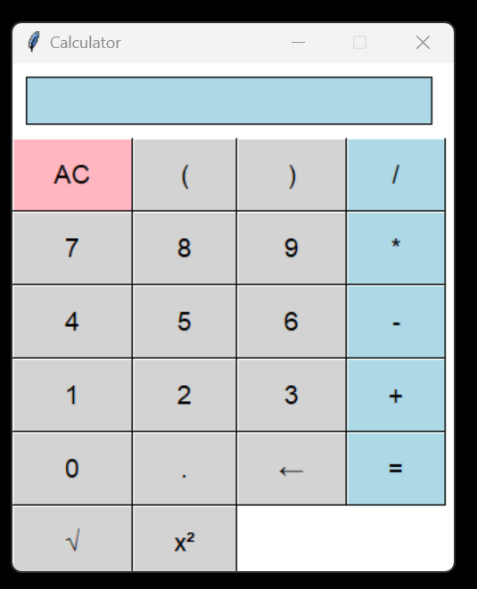

# Custom Calculator with Tkinter

This is a simple calculator application built using Python's Tkinter library. It provides basic arithmetic operations such as addition, subtraction, multiplication, and division, along with other functionalities like square root and clearing the input.

## Features

- **Arithmetic Operations**: Perform basic arithmetic calculations like addition, subtraction, multiplication, and division.
- **Clear Input**: Clear the input field to start fresh with a new calculation.
- **Backspace**: Remove the last character entered.
- **Square Root**: Calculate the square root of a number.
- **Power of 2**: Calculate the square of a number.
- **Visual Interface**: User-friendly interface designed with Tkinter.
- **Custom Buttons**: Manually drawn images used for buttons to enhance visual appeal.

## Installation

1. Clone this repository to your local machine:

```
git clone https://github.com/Ur-Code-Buddy/calthon.git
```

2. Navigate to the project directory:

```
cd calthon
```

3. Install the required dependencies using pip:

```
pip install -r requirements.txt
```

## Usage

Run the `app.py` file to start the calculator application:

```
python app.py
```

## Screenshots



## Contributing

Contributions are welcome! If you have any suggestions, enhancements, or bug fixes, please open an issue or submit a pull request.

## License

This project is licensed under the MIT License - see the [LICENSE](LICENSE) file for details.

## Download

You can download the repository as a zip file using the following link:

[Download ZIP](https://github.com/Ur-Code-Buddy/calthon/archive/main.zip)
